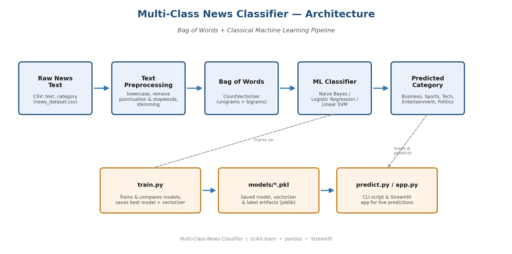

# 📰 Multi-Class News Classifier

Multi-class text classification using NLP. Classifies news articles into **5 categories**
(Business, Sports, Technology, Entertainment, Politics) using a **Bag of Words**
representation and classic **machine learning** models (Naive Bayes, Logistic Regression,
Linear SVM).

This is a beginner/intermediate friendly NLP project that runs **end-to-end, fully offline**
— no API keys, no Kaggle downloads, no internet access required to get started.



---

## ✨ Features

- Clean, modular project structure (`data/`, `src/`, `models/`, `docs/`)
- Text preprocessing: lowercasing, punctuation/stopword removal, stemming
- **Bag of Words** feature extraction with `CountVectorizer` (unigrams + bigrams)
- Trains & compares 3 classic ML models, automatically keeps the best one:
  - Multinomial Naive Bayes
  - Logistic Regression
  - Linear SVM
- Saves the trained model, vectorizer, and evaluation report (confusion matrix)
- Command-line prediction script
- Optional interactive **Streamlit** web app for live predictions
- Fully offline synthetic dataset generator so the project works out of the box
  (with instructions to swap in a real dataset)

---

## 🗂️ Project Structure

```
Multi-Class-News-Classifier/
├── app.py                          # Streamlit demo app
├── requirements.txt                # Python dependencies
├── LICENSE
├── README.md
├── data/
│   ├── generate_dataset.py         # Creates the offline synthetic dataset
│   └── news_dataset.csv            # 700 sample articles, 5 categories
├── src/
│   ├── preprocess.py               # Text cleaning utilities
│   ├── train.py                    # Training pipeline (BoW + model comparison)
│   └── predict.py                  # CLI prediction script
├── models/                         # Saved model, vectorizer & labels (joblib)
│   ├── news_classifier.pkl
│   ├── count_vectorizer.pkl
│   ├── labels.pkl
│   └── best_model_name.txt
├── docs/
│   ├── architecture.png            # Pipeline architecture diagram
│   ├── confusion_matrix.png        # Evaluation result from training
│   └── make_architecture_diagram.py
└── notebooks/
    └── 01_EDA_and_Training.ipynb   # Exploratory notebook version of the pipeline
```

---

## 🏗️ Architecture

```
Raw News Text → Text Preprocessing → Bag of Words → ML Classifier → Predicted Category
     (CSV)      (clean, stopwords,    (CountVectorizer)  (NB / LogReg /   (5 classes)
                    stemming)                                 SVM)
```

See [`docs/architecture.png`](docs/architecture.png) for the full diagram, generated by
[`docs/make_architecture_diagram.py`](docs/make_architecture_diagram.py).

---

## 🚀 Getting Started

### 1. Clone & install dependencies

```bash
git clone https://github.com/<your-username>/Multi-Class-News-Classifier.git
cd Multi-Class-News-Classifier
pip install -r requirements.txt
```

### 2. Generate the dataset (already included, but you can regenerate it)

```bash
python data/generate_dataset.py
```

This creates `data/news_dataset.csv` with ~700 short news-style articles evenly split
across 5 categories — fully offline, no downloads needed.

### 3. Train the model

```bash
python src/train.py
```

This will:
1. Load and clean the dataset
2. Build a Bag of Words representation with `CountVectorizer`
3. Train Naive Bayes, Logistic Regression, and Linear SVM
4. Print accuracy & a classification report for each
5. Save the best model + vectorizer to `models/`
6. Save a confusion matrix image to `docs/confusion_matrix.png`

### 4. Make predictions from the command line

```bash
python src/predict.py "The central bank raised interest rates for the third time this year."
# -> Predicted category: Business
```

Or run it without arguments for interactive mode:

```bash
python src/predict.py
```

### 5. (Optional) Launch the web app

```bash
streamlit run app.py
```

Then open the local URL Streamlit prints (usually `http://localhost:8501`) and try typing
in your own headlines.

---

## 📊 Results

With the included synthetic dataset, all three models reach very high accuracy
(the synthetic data uses distinct vocabulary per category, which is ideal for
demonstrating how Bag-of-Words models work). See `docs/confusion_matrix.png` after
running `train.py` for your own results.

| Model                    | Accuracy (test set) |
|---------------------------|:-------------------:|
| Multinomial Naive Bayes  | ~1.00                |
| Logistic Regression      | ~1.00                |
| Linear SVM                | ~1.00                |

> Real-world datasets (see below) will show more realistic, imperfect accuracy —
> a great opportunity to practice tuning `max_features`, n-grams, and trying TF-IDF.

---

## 🔄 Using a Real Dataset (Optional, Recommended Next Step)

The included dataset is synthetic so the project works immediately with zero setup.
For a more realistic project, swap in a real news dataset:

**Option A — BBC News dataset (Kaggle)**
1. Download the [BBC News Classification dataset](https://www.kaggle.com/competitions/learn-ai-bbc) from Kaggle
   (columns: `Text`, `Category` — 5 classes: business, entertainment, politics, sport, tech).
2. Save it as `data/news_dataset.csv` with columns renamed to `text,category`.
3. Re-run `python src/train.py`.

**Option B — scikit-learn's 20 Newsgroups dataset**
```python
from sklearn.datasets import fetch_20newsgroups
categories = ["rec.sport.hockey", "sci.space", "comp.graphics",
              "talk.politics.mideast", "rec.autos"]
data = fetch_20newsgroups(subset="all", categories=categories,
                           remove=("headers", "footers", "quotes"))
```
Map `data.target_names` to friendly category labels and save as `text,category` CSV.

No other code changes are required — `train.py` works with any CSV that has
`text` and `category` columns.

---

## 🧠 How It Works (Beginner Explanation)

1. **Bag of Words** turns each article into a vector of word counts — it ignores grammar
   and word order, just counts how often each word (or word pair) appears.
2. Because word choice differs a lot between topics (e.g. "goal" and "match" vs.
   "shares" and "earnings"), even a simple counts-based model can separate categories well.
3. A classic ML classifier (Naive Bayes, Logistic Regression, or SVM) learns which words
   are most associated with each category from the training data.
4. At prediction time, new text goes through the same cleaning + vectorization steps,
   and the trained model outputs the most likely category.

---

## 🛠️ Tech Stack

- Python 3.10+
- [scikit-learn](https://scikit-learn.org/) — Bag of Words (`CountVectorizer`) & ML models
- [pandas](https://pandas.pydata.org/) — data handling
- [matplotlib](https://matplotlib.org/) — confusion matrix & architecture diagram
- [NLTK](https://www.nltk.org/) — stemming (optional, degrades gracefully if not installed)
- [Streamlit](https://streamlit.io/) — optional interactive demo app

---

## 📈 Possible Improvements (Great "Intermediate" Extensions)

- Swap `CountVectorizer` for `TfidfVectorizer` and compare results
- Add cross-validation and hyperparameter tuning (`GridSearchCV`)
- Try word embeddings (Word2Vec, GloVe) or a transformer-based model (e.g. DistilBERT)
- Deploy the Streamlit app to Streamlit Community Cloud or Hugging Face Spaces
- Add unit tests for `preprocess.py` and `predict.py`
- Track experiments with MLflow

---

## 📄 License

This project is licensed under the [MIT License](LICENSE).
